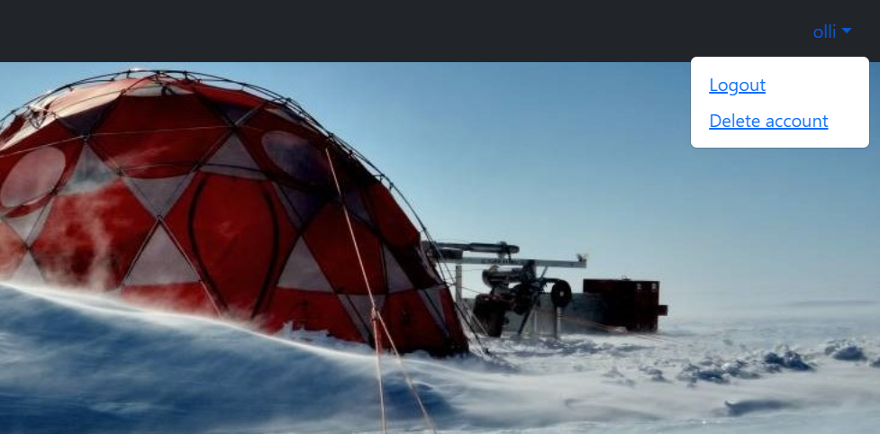

# Ilmastonmuutokseen liittyvän tiedon visualisointityökalu “ClimateView”

 
 

**Tekijät:** Antti Lassila, Antti Tiikkala, Abdulah Yusuf ja Konsta Juola  
 

  

## <ins>Kuvaus</ins>  

Tekijät ovat Oulun ammattikorkeakoulun 2. vuoden ohjelmistokehityksen opiskelijoita, jotka toteuttivat tämän ilmastonmuutoksen datan visualisointiin käytettävän työkalun sovellusprojektina syyslukukaudella 2022. Työtehtävät jaettiin tasaisesti kaikkien neljän jäsenen kesken. Kaikki jäsenet toimivat Full Stack -kehittäjinä työstäen client- ja server-puolta.  

Nimellä ClimateView-työstetty työkalu on Googlen pilvialustalla toimiva web-pohjainen REST API-sovellus, joka sisältää ilmastonmuutokseen liittyviä mittauksia eri aikaväleiltä ja visualisoi ne graafeiksi.  

Projektin frontend toteutettiin käyttäen React.js-nimistä JavaScript-kirjastoa ja backend käyttäen Java-Spring ajoympäristöä. Tietokantana käytimme MySQL-tietokantaa. Frontend puolella haimme tietokannasta mittaustuloksia axios-pyynnöillä.  
 

## <ins>Sovellus</ins>

**Web sivu**  
  

Yläpalkista löytyy "ClimateView"-painike joka palauttaa käyttäjän takasin etusivulle, ”Climate measurements” vie käyttäjän visualisointinäkymään. Visualisointinäkymän etusivulla käyttäjä  voi valita kahdesta eri painikkeesta haluamansa näkymän, jotka ovat ”V1-V7&V10graphs” ja “V8 & V9graphs”. Ensimmäinen näkymä sisältää graafit liittyen lämpötilatietoihin ja co2 pitoisuuksiin, toisessa näkymässä on graafit liittyen päästölähteisiin (päästöt maa- ja sektorikohtaisesti). Kaikki näkymät aukeavat omille sivulleen.  

<ins>**Kuva 1.**</ins> Climate measurements  

  

<ins>**Kuva 2.**</ins> Esimerkki kuva graafista.  

  

<ins>**Kuva 3.**</ins> Oikealla näkyvät linkit ovat käyttäjän kirjautumiseen ja rekisteröitymiseen. Rekisteröityminen tapahtuu klikkaamalla “Signup”-toimintoa johon uusi käyttäjä syöttää nimen, sähköpostiosoitteen ja salasanan.  
Rekisteröitymisen jälkeen käyttäjä tallentuu MySql- tietokantaan josta näkee käyttäjän nimen, sähköpostiosoitteen ja salasanan (cryptattuna).  
Rekisteröitymisen jälkeen sivu päivittyy kirjautumisosioon johon käyttäjä syöttää nimen ja salasanan. Autentikointi käyttäjälle on tehty käyttämällä bearer-tokenia.  
Kirjautuessa sisään käyttäjän tokeni tallentuu automaattisesti selaimen local-storageen, mistä se on kopioitavissa käyttäjän tietojen hakua varten.  
Käyttäjän antaessa väärän salasanan, tulostuu selaimelle varoitus ilmoitus “Väärä käyttäjätunnus tai salasana, yritä uudelleen”.  

   
  

<ins>**Kuva 4.**</ins> Kirjautumisen jälkeen selaimen oikeassa yläkulmassa näkyy pudotusvalikko, jonka kautta pääsee tekemään eri toimintoja (kirjaudu ulos ja poista käyttäjä).  

   
  
  
## Linkki videoon:

https://youtu.be/wHpqIX28BcA 
